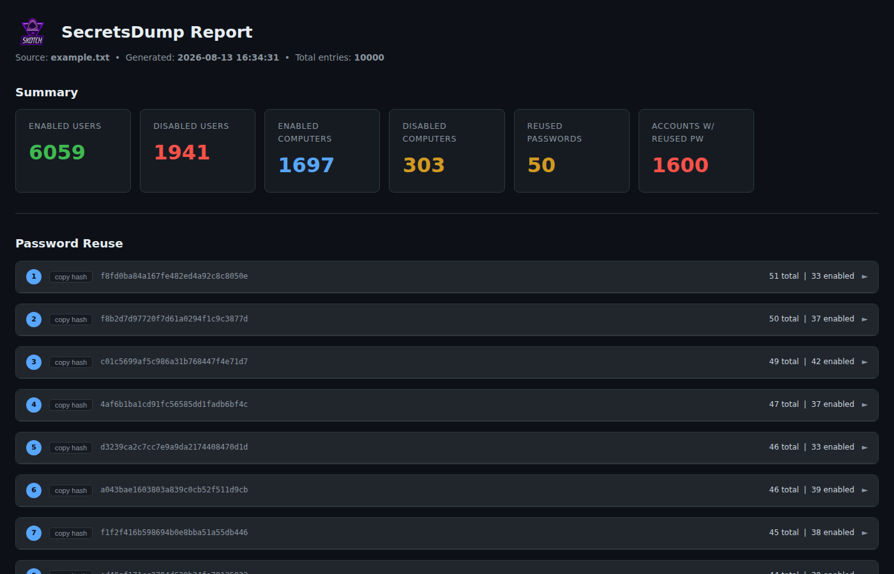

# SecretsDump Reporter

Parses the output of [Impacket](https://github.com/fortra/impacket)'s `secretsdump.py` (run with `-user-status`) and produces a self-contained HTML report and a CSV file for further analysis.



## Features

- **Account summary** — enabled/disabled counts for users and computers
- **Password reuse analysis** — groups accounts sharing the same NT hash, with enabled accounts highlighted
- **Two HTML reports** — full hashes and a redacted version (first/last 4 characters shown) safe to share
- **CSV export** — full account list with reuse group numbers for filtering in Excel/similar
- **Self-contained output** — the HTML report embeds all assets (logo, CSS, JS); no internet connection required to view it
- No external Python dependencies — stdlib only

## Requirements

- Python 3.10+

## Usage

```
python3 sdr.py <secretsdump_output.txt>
```

### Options

| Flag | Description |
|---|---|
| `input` | Path to the secretsdump output file |
| `-o / --output` | Base name for output files (default: input filename without extension) |

### Example

```
python3 sdr.py dump.txt
python3 sdr.py dump.txt -o results/report
```

## Output files

| File | Description |
|---|---|
| `<base>.html` | Full HTML report including NT hashes and copy-to-clipboard buttons |
| `<base>_redacted.html` | Same report with hashes redacted (`xxxx************************xxxx`) |
| `<base>.csv` | Full account list — domain, username, RID, NT hash, type, status, reuse group |

## Input format

secretsdump must be run with `-user-status` to include account status in the output:

```
secretsdump.py -user-status <target>
```

Expected line format:

```
domain\username:RID:LM_hash:NT_hash::: (status=Enabled|Disabled)
```

Computer accounts (ending in `$`) are automatically distinguished from user accounts.
